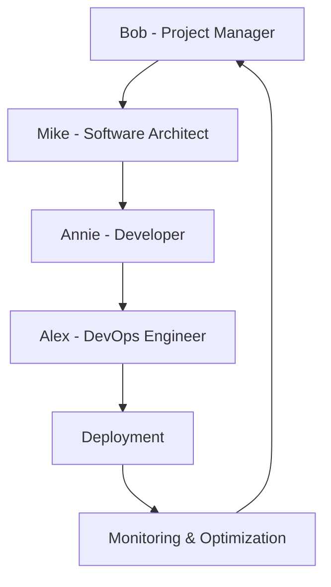

<h1 align="center">
  <br>

  <br>
  Groq Agentic Workflow
  <br>
</h1>

<h4 align="center">🚀 Next-Gen AI-Powered Autonomous Python Development Platform 🤖</h4>

<p align="center">
  <a href="https://www.python.org/downloads/release/python-3120/">
    
  </a>
  <a href="https://opensource.org/licenses/MIT">
    

  <a href="https://github.com/Drlordbasil/GroqAgenticWorkflow/stargazers">
    
  </a>
</p>

<p align="center">
  <a href="#-key-features">Key Features</a> •
  <a href="#-quick-start">Quick Start</a> •
  <a href="#-how-it-works">How It Works</a> •
  <a href="#-performance">Performance</a> •
  <a href="#-potential-use-cases">Use Cases</a> •
  <a href="#-roadmap">Roadmap</a> •
  <a href="#-contributing">Contributing</a> •
  <a href="#-faq">FAQ</a> •
  <a href="#-license">License</a>
</p>

---

## 🌟 Welcome to the Future of AI-Driven Development

GroqAgenticWorkflow is a revolutionary AI system that harnesses the power of Groq technology to autonomously generate profitable Python scripts. Our cutting-edge platform combines specialized AI agents, advanced NLP, and state-of-the-art language models to create a truly self-sustaining development ecosystem.


---

## 🚀 Key Features

<details>
<summary>Click to expand feature list</summary>

- **🧠 AI-Powered Collaboration**: Four specialized AI agents work in harmony to manage, develop, and optimize projects
- **⚡ Groq Integration**: Leverage Groq's lightning-fast AI models for unparalleled performance
- **💡 Autonomous Ideation**: Self-generating project ideas with market potential analysis
- **🌐 Intelligent Web Research**: Advanced web scraping and data synthesis capabilities
- **🛠️ Robust Code Management**: Automated testing, optimization, and version control
- **💰 Crypto Wallet Integration**: Seamless blockchain transactions and profit management
- **🔗 Smart Memory Handling**: Efficient data management using Ollama and ChromaDB
- **📊 NLP-Driven Task Management**: Automated task extraction, prioritization, and tracking
- **🔄 Continuous Learning**: Self-improving algorithms for ever-increasing efficiency(future improvement)
- **🔐 Enterprise-Grade Security**: Built-in safeguards for code and data protection(future improvement)

</details>

---

## 🏁 Quick Start

Get GroqAgenticWorkflow up and running in minutes:

```bash
# Clone and enter the repository
git clone https://github.com/Drlordbasil/GroqAgenticWorkflow.git && cd GroqAgenticWorkflow
# download ollama
download ollama at ollama.com
# pull the models
ollama pull qwen:0.5b
ollama pull mxbai-embed-large


# Set up environment and install dependencies
python -m venv venv && source venv/bin/activate && pip install -r requirements.txt

# Download required models
python -m spacy download en_core_web_sm

# Configure API key
echo "GROQ_API_KEY=your_api_key_here" > .env

# Launch the AI workforce
python agentic.py
```

---

## 🔬 How It Works

GroqAgenticWorkflow operates on a revolutionary AI-driven architecture:

1. **Idea Generation**: Bob, our PM AI, brainstorms project ideas based on market trends and potential profitability.
2. **Architecture Design**: Mike, the AI Architect, designs the software structure and selects optimal algorithms.
3. **Development**: Annie, our AI Developer, writes, tests, and refines the code based on the architecture.
4. **DevOps & Deployment**: Alex, the DevOps AI, manages the infrastructure, testing, and deployment pipeline.
5. **Continuous Optimization**: The entire team collaborates to continuously improve the codebase and processes.

<details>
<summary>View detailed system architecture</summary>



</details>

---

GroqAgenticWorkflow is not just a development tool; it's a catalyst for innovation across all sectors, pushing the boundaries of what's possible with AI-driven solutions.

---

## 🛣️ Roadmap

Our vision for the future of GroqAgenticWorkflow:


- [ ] AI-driven market analysis and trend prediction
- [ ] Automatic generation of mobile and web applications
- [ ] Self-evolving AI agents for continuous improvement
- [ ] Blockchain-based decentralized collaboration network

---

## 🤝 Contributing

We welcome contributions from innovators worldwide! Here's how to get involved:

1. 🍴 Fork the repository
2. 🌿 Create your feature branch: `git checkout -b feature/AmazingFeature`
3. 💍 Commit your changes: `git commit -m 'Add some AmazingFeature'`
4. 🚀 Push to the branch: `git push origin feature/AmazingFeature`
5. 🎉 Open a pull request

Please read our [Contribution Guidelines](CONTRIBUTING.md) for more details.

---

## ❓ FAQ

<details>
<summary><strong>Is GroqAgenticWorkflow suitable for beginners?</strong></summary>
Absolutely! While our system is powerful, it's designed to be user-friendly for developers of all levels. Our extensive documentation and community support make it accessible to everyone.
</details>

<details>
<summary><strong>How does GroqAgenticWorkflow ensure code quality?</strong></summary>
Our AI agents are trained on best coding practices and use advanced static analysis tools. Additionally, Alex, our DevOps AI, runs comprehensive test suites to ensure top-notch quality.
</details>

<details>
<summary><strong>Can GroqAgenticWorkflow integrate with existing projects?</strong></summary>
Yes! GroqAgenticWorkflow is designed to seamlessly integrate with existing codebases. It can analyze your current project and suggest improvements or extensions.
</details>

---

## 📜 License

This project is licensed under the MIT License - see the [LICENSE](LICENSE) file for details.

---

## 💖 Support GroqAgenticWorkflow

If GroqAgenticWorkflow has impressed you, consider showing your support:

- ⭐ Star this repository
- 🐦 Follow us on [Twitter](https://twitter.com/GroqAgenticFlow)
- 💼 Connect on [LinkedIn](https://www.linkedin.com/company/groqagenticworkflow)
- 🗣️ Spread the word about GroqAgenticWorkflow

Your support helps us continue innovating and pushing the boundaries of AI-driven development!

---

<p align="center">
  <sub>Built with 💖 by <a href="https://github.com/Drlordbasil">Drlordbasil</a> and our amazing <a href="https://github.com/Drlordbasil/GroqAgenticWorkflow/graphs/contributors">contributors</a></sub>
</p>

<!-- SEO and topic tags -->
<p align="center">
  <a href="https://github.com/topics/artificial-intelligence"></a>
  <a href="https://github.com/topics/machine-learning"></a>
  <a href="https://github.com/topics/groq"></a>
  <a href="https://github.com/topics/autonomous-agents"></a>
  <a href="https://github.com/topics/python"></a>
</p>
